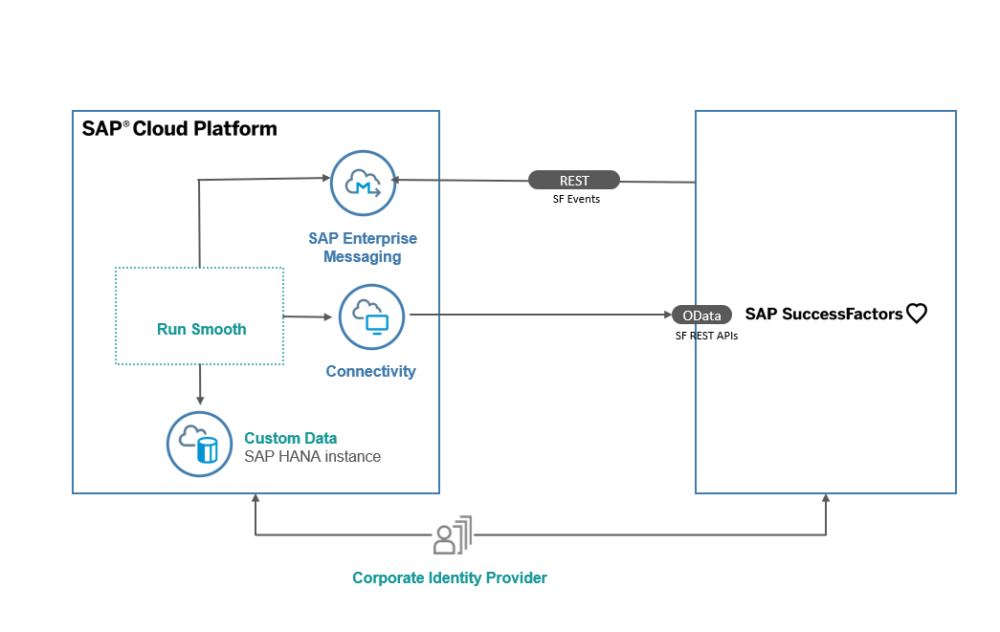
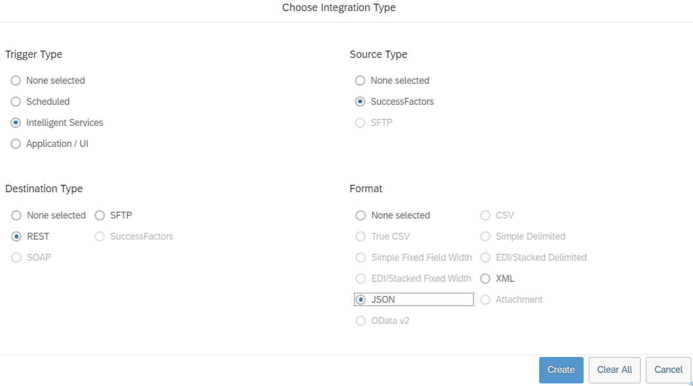
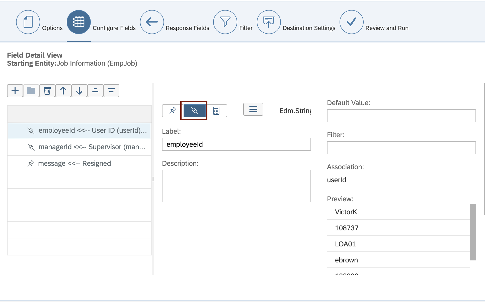
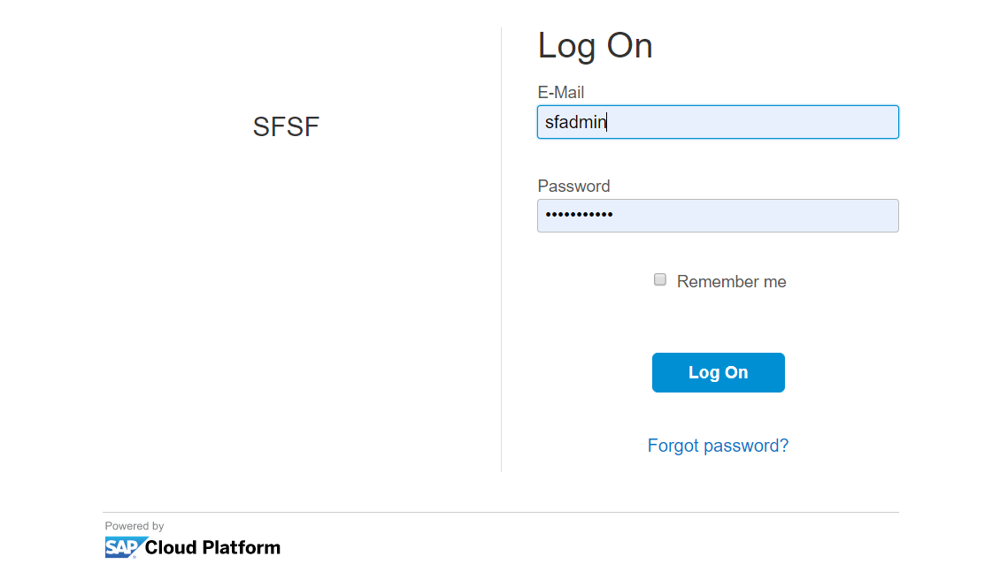
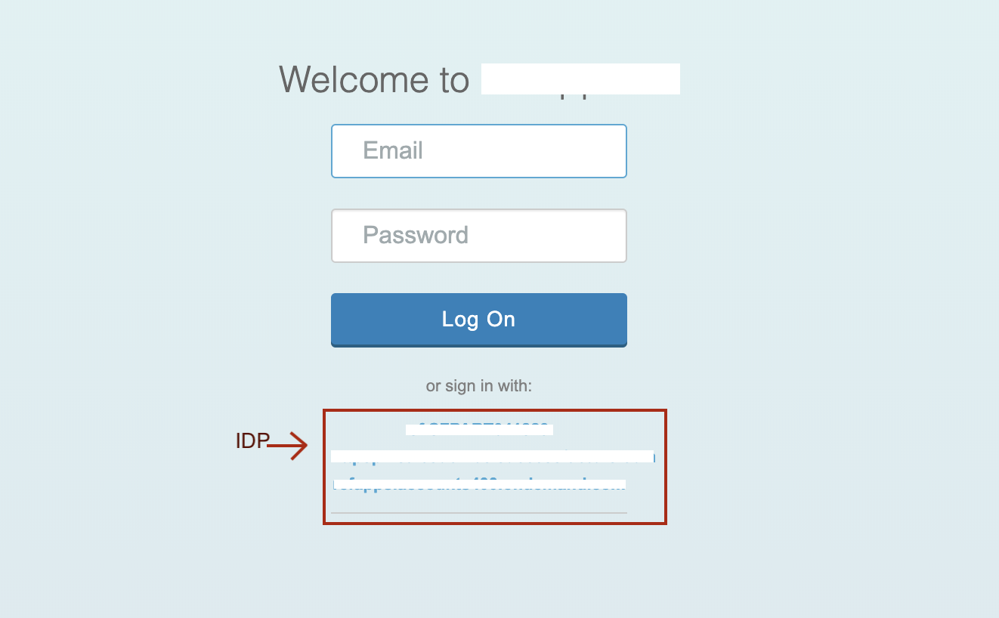
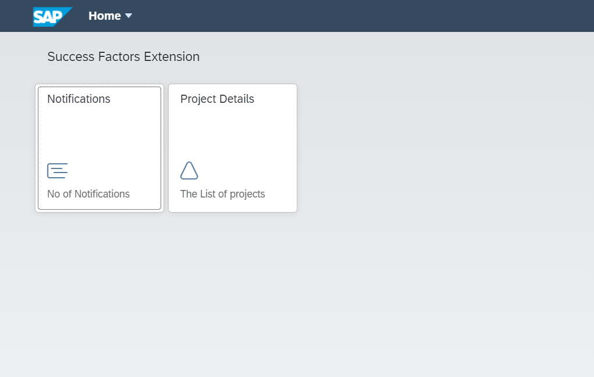
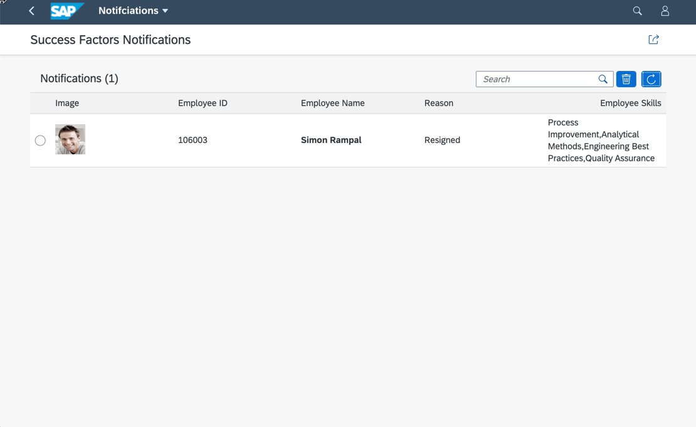

# SucessFactors Extension Application - "Run Smooth"

## Description: 
`Run Smooth` is a reference application that shows how to extend SuccessFactors employee central with an application that runs on SAP Cloud Platform. 

This application showcases:
1. Using SAP Cloud Platform Extension Factory service
2. Cloud Application Programming Model(CAP) to build application
3. Handling of SF events via Enterprise Messaging
4. Connectivity with SF REST API’s
5. SCI(IAS) Tenant integration with SF


#### Scenario: 

Managers can maintain the details of their direct reports and the projects that they are working on in `Run Smooth` application. 
When an employee decides to leave the team/ company, an event is triggered in the SuccessFactors system. The Run Smooth application subscribes to this event and sends out a notification to the manager with the topics to be handed over to fellow team mates and the preferred skill set for the replacement hire to maintain the status quo in the team. 

#### Features:
* Login with SuccessFactors UserId, password. 
* View the list of projects, employees working on the projects. 
* Get notification when an employee is leaving the team with the consolidated report on the skills of the employee.

## Architecture

### Solution Diagram



The Run Smooth application is developed using [SAP Cloud Application programming Model (CAP)](https://cap.cloud.sap/docs/) and runs on Cloud Foundry Environment. It consumes platform services like Enterprise Messaging, HANA and Connectivity. The events generated in SuccessFactors are inserted into the Enterprise messaging queue. The application running in Cloud Foundry polls the queue for these messages and inserts them into the HANA database. The run smooth application also makes calls to SF oData APIs to get SF data. 

## Requirements 
* [Node js](https://nodejs.org/en/download/)
* SuccessFactors test or demo instance. 
>Note: Please do not try this application on a productive instance.
* [Cloud Foundry Command Line Interface (CLI)](https://github.com/cloudfoundry/cli#downloads)
* Cloud Foundry trial or enterprise account, [sign up for a Cloud Foundry environment trial account on SAP Cloud Platform](https://help.sap.com/viewer/65de2977205c403bbc107264b8eccf4b/Cloud/en-US/76e79d62fa0149d5aa7b0698c9a33687.html)
* To build the multi target application, we need the [Cloud MTA Build tool](https://sap.github.io/cloud-mta-build-tool/), download the tool from [here](https://sap.github.io/cloud-mta-build-tool/download/)
* For Windows system, install 'MAKE' from https://sap.github.io/cloud-mta-build-tool/makefile/ 

## Configuration

### Step 1: Configure trust between SF and CP using Extension Factory
 
 Follow steps 1, 2 and 4 from in this [document](https://help.sap.com/viewer/65de2977205c403bbc107264b8eccf4b/Cloud/en-US/9e33934540c44681817567d6072effb2.html) to set up trust and destination to access SuccessFactors system using Extension Factory.
> Ignore step 3 in the document. 

### Step 2: Project Configuration
1. [Clone](https://help.github.com/articles/cloning-a-repository/) this [repository](../..)
2. Open [mta.yaml](mta.yaml)
3. Go to the section `Success Factors Extensibility Service` and modify the SuccessFactors System name as per the name given while registering the System in previous Step. Also, check if the Extension Factory service instance name matches in the `mta.yaml`.
3. Go to the section `Enterprise Messaging Service`
4. Check in your CF account which service plan is available for Enterprise Messaging Service.
    1. Dev Plan
        1. Modify `"emname": "<yourmessageclientname>" ` with necessary details in the dev.json
        2. Uncomment the respective section in mta.yaml. 
        3. Open the srv/cat-service.js file uncomment the line no 13 (comment line 12).
    2. Default Plan 
        1. Modify `"emname": "<yourmessageclientname>","namespace": "<yourorgname>/<yourmessageclientname>/<uniqueID>"` with necessary details in the “default.json” file. 
        2. Uncomment the respective section in mta.yaml. 
        3. Open the srv/cat-service.js file uncomment the line no 12 (comment line 13).

### Step 3: Deploy the reference application
>Note: Please set the npm registry for @sap libraries using the command :  
`npm set @sap:registry=https://npm.sap.com`
1. Build the application
    `mbt build -p=cf `  
3. Login to Cloud Foundry by typing the below commands on command prompt
    ```
    cf api <api>
    cf login -u <username> -p <password> 
    ```
    `api` - [URL of the Cloud Foundry landscape](https://help.sap.com/viewer/65de2977205c403bbc107264b8eccf4b/Cloud/en-US/350356d1dc314d3199dca15bd2ab9b0e.html) that you are trying to connect to.
    
    Select the org and space when prompted to. For more information on the same refer [link](https://help.sap.com/viewer/65de2977205c403bbc107264b8eccf4b/Cloud/en-US/75125ef1e60e490e91eb58fe48c0f9e7.html#loio4ef907afb1254e8286882a2bdef0edf4).

4. Deploy the application
	
	Navigate to mta_archives folder.
	
   `cf deploy cloud-cap-xf-sf_0.0.1.mtar`


### Step 4: Setting up SuccessFactors system

In this step, you will configure the successFactors system to send message to the Enterprise Messaging service on Cloud platform. 

1. Login to the sf demo instance. 
 
    username: sfadmin
	password: `<It will be provided to you in the mail that you receive on requesting for demo instance. >`
	
2. Setting Outbound OAuth Configurations. In this step, the credentials required to send messages to the Enterprise Messaging service are set. 
   
   1. In the demo instance search bar, search for `Integration center`
   2. Select `Security center`
   3. Select `Outbound OAuth Configurations`
   4. Click on `add` to create new OAuth configuration
   5. Enter the below detail:
  
      OAuth Type: `OAuth 2.0`
  
      Grant Type: `Client_Credentials`
  
      `Client ID`, `Client Secret`, `Token URL`: you can get these details from the service key of the enterprise message service instance you created in Step 1. 
  
      Add Custom Header Parameters. 
 
      Add new row: key=x-qos. Value =1 
      
3. Creating integration. An integration specifies the endpoint to which a message should be send along with the content of the message.
   1. Navigate to integration center. 
   2. Select `My Integrations`
   3. Select `Create` > `More Integration Types`
   4. Select the below options and click on Create:

      Trigger type: Intelligent service
 
      Destination type: REST
 
      Format: JSON
  
   

4. Search for the [intelligent service](https://help.sap.com/viewer/b8da92fb08c347cbab0c8fff82af0a3f/1911/en-US/3d91617db9a94903a0237747e4eda11f.html) `Employment Termination`. Select it and click on `Select` button.

5. Provide details for the integration. 
   1. Enter name for the integration and click next
   2. In Configure Fields tab, Click `+` button . Insert sibling elements
   3. Select the created element and set label as 'userid'
   4. Click on `Set as Assosiated field` button. Select entity tree view. Select `User ID`. Click on 'Change Association to User Id'
   
   5. Similarly add new sibling for `managerId` and associate it with Supervisor id. 
   6. Add new sibling element `message` with default value as 'Resigned'
   7. Keep the default settings for `Response field`, `Filter` tabs. 
   8. Edit the `Destination Settings` with the following details:
      
      REST API URL: give the URL of the queue
      `https://enterprise-messaging-pubsub.cfapps.eu10.hana.ondemand.com/messagingrest/v1/topics/<topicName>/messages`
      > By default topic name for this application is `sfemessage` 
 
      Authentication type: OAuth
 
      OAuth Configuration: Select the configuration created in Step 2.
 
      
  
   9. Click on `save`
 
   10. In `Review and Run` tab - click on `run now`
 
 6. Configuring the event flow. This step ensures that when the event is triggered, the integration created in the above step is run. 
   1. Search for `Intelligent Service` in the demo instance search bar. 
   2. Select `Employment Termination` event. There are many more events available, in our scenario, 
   3. Add integration for the existing flow: 
      - Click on `Integration` under `Activities`. (on the right-hand side corner)
      - Select the integration created in the previous step. click on `Add integration` and `Save` the flow.

## Demo Script

1. Login to SF demo instance with sfadmin user.

2. Search for Employee David Leal (dleal) in the Employee Directory
3. Select Employee David Leal
> You can choose any employee who is a Manager. 
4. Click on Actions button and Select Org Chart

5. Choose an employee who is reporting to 'David Leal e.g Penelope Miller(pmiller)
6. Click on Take Actions button and Select Termination

7. Set values for 
      - Termination Date (Recommended to use a future date. For example, a date one week from the current date) 
      - Termination Reason - Early Retirement
      - Ok to Rehire - Yes
      - Regret Termination - Yes

8. Click on Save.
9. In the window `Please confirm your request`, click on the 'Show workflow participants'. 
10. Workflow participants would be shown as 1. Paul Atkins (Production Director); 2. Tessa Walker (HR Business Partner Global), Christine Dolan (Chief Human Resources Officer)
> This means that Paul Atkins and Tessa Walker (or Christine Dolan) must approve this request to proceed. 
11. Click on Confirm button
12. Use Proxy Now functionality and Select Target User as Paul Atkins(patkins)

13. In the Home page of Paul Atkins click on tile Approve Requests
14. Click on Approve button for the request for approval of Early Retirement of Penelope Miller

15. Use Proxy Now functonality and Select Target User as Tessa Walker(twalker)
16. In the Home page of Tessa Walker click on tile Approve Requests
17. Click on Approve button for the request for approval of Early Retirement of Penelope Miller
18. Open the Web Application UI for Run Smooth application in browser. 
> In the Step 4 of Configure trust between SF and CP using Extension Factory (see above) you would have already configured Single-Sign On between SAP Cloud Platform Subaccount and SAP SuccessFactors. This is the Identity Provider (IDP) to be used to login to the application. You can find all the IDPs available in the Login page as shown below:

19. Choose the SuccessFactors IDP and Login with userId David Leal (dleal) and password (by default, it is same as sfadmin). 
20. Click on notifications tile. 

21. Notification will be displayed regarding Resignation of Penelope Miller along with her Skillset. 


## Known Issues

No known issues.

## How to Obtain Support

In case you find a bug, or you need additional support, please open an issue here in GitHub.
