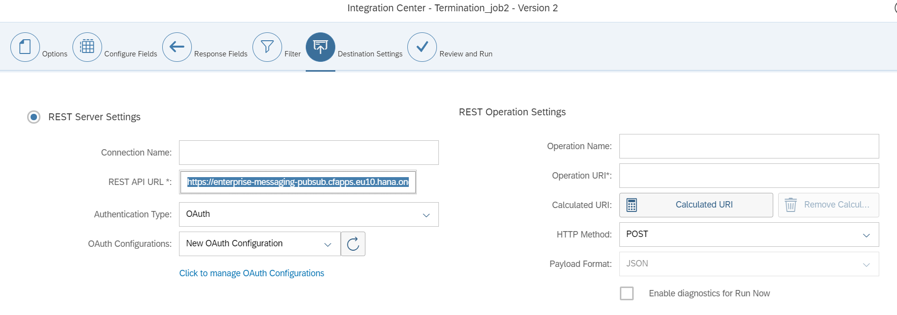

# cloud-sf-extension-cap-sample

## Description: 
This repository contains a reference application -`Run Smooth` that shows how to extend SuccessFactors employee central with an application that runs on SAP Cloud Platform using the Extension Factory service and Cloud Application Programming Model. 

This application showcases:
1. Using SAP Cloud Platform Extension Factory service
2. Cloud Application Programming Model(CAP) to build application
3. Handling of SF events via Enterprise Messaging(Webhooks)
4. Connectivity with SF REST API’s
5. SCI(IAS) Tenant integration with SF

#### Scenario: 

Managers can maintain the details of their direct reports and the projects that they are working on in `Run Smooth` application. 
When an employee decides to leave the team/ company, an event is triggered in the SuccessFactors system. The Run Smooth application subscribes to this event and sends out a notification to the manager with the topics to be handed over to fellow team mates and the preferred skill set for the replacement hire to maintain the status quo in the team. 

#### Features:
* Login with SuccessFactors user Id, password. 
* View the list of projects, employees working on the projects. 
* Get notification when an employee is leaving the team with the consolidated report on the skills of the employee.

## Architecture

### Solution Diagram

The Run Smooth application is developed using [SAP Cloud Application programming Model (CAP)](https://cap.cloud.sap/docs/) and runs on Cloud Foundry Environment. It consumes platform services like Enterprise Messaging, HANA and Connectivity. The events generated in SuccessFactors are inserted into the Enterprise messaging queue. The application running in Cloud Foundry polls the queue for these messages and inserts them into the HANA database. The run smooth application also makes calls to SF oData APIs to get SF data. 

## Configuration

### Step 1: Creating Enterprise messaging, HANA service instances

[create an Enterprise messaging service instance](https://help.sap.com/viewer/bf82e6b26456494cbdd197057c09979f/Cloud/en-US/d0483a9e38434f23a4579d6fcc72654b.html) 

[Create HANA instance](https://help.sap.com/viewer/cc53ad464a57404b8d453bbadbc81ceb/Cloud/en-US/83b8a3ff92c245399e2fac2eaab09582.html)

### Step 2: Setting up SuccessFactors system

1. Procure an SF instance.

2. Setting Outbound OAuth Configurations
   1. Login to the instance
   2. Search for `Integration center`
   3. Select `Security center`
   4. Select `Outbound OAuth Configurations`
   5. Click on `add` to create new OAuth configuration
   6. Enter the below detail:
  
      OAuth Type: `OAuth 2.0`
  
      Grant Type: `Client_Credentials`
  
      `Client ID`, `Client Secret`, `Token URL`: you can get these details from the service key of the enterprise message service instance you created in Step 1. 
  
      Token URL: append the token url with `/oauth/token`
  
      Add Custom Header Parameters. 
 
      Add new row: key=x-qos. Value =1 
      
2. Creating integration
   1. Navigate to integration center. 
   2. Select `My integrations`
   3. Select `create` > `More integration types`
   4. Select the below details and click on create:
 
      Trigger type: intelligent service
 
      Destination type: REST
 
      Format: json
  
   

3. Search for the intelligent service `Employment Termination`. Select it and click on `Select` button.

5. Provide details for the integration
   1. Enter name for the integration and click next
   2. In Configure Fields tab, Click `+` button . Insert sibling elements
   3. Give label as 'userid'
   4. Click on `set an Assosiated field` button. Select entity tree view. Select `User ID`. Click on 'Change Association to user id'
   5. Similarly add new sibling for managerId. and associate it with supervisor id. 
   6. Add new sibling element `message` with default value as 'resigned'
   7. Keep the default settings for `Response field`, `filter` tabs. 
   8. Edit the `Destination Settings` with the following details:
      
      REST API URL: give the URL of the queue
      `https://enterprise-messaging-pubsub.cfapps.eu10.hana.ondemand.com/messagingrest/v1/topics/< topic name >/messages`
 
      Authentication type: OAuth
 
      OAuth Configuration: Select the configuration created in Step 2.
 
      
  
   9. Click on `save`
 
   10. In `Review and Run` tab - click on `run now`
 
 6. Configuring the event flow
   1. Search for `intelligent service`. 
   2. Select `Employment termination` event
   3. Add integration for the existing flow: 
      - click on `Integration` under `Activities`. (on the right-hand side corner)
      - Select the integration created in the previous step. click on `Add integration`
 
### Step 3: Configure trust between SF and CP using extension factory
 
[Refer the document to set up trust, SF destination using Extension Factory.](https://help.sap.com/viewer/65de2977205c403bbc107264b8eccf4b/Cloud/en-US/9e33934540c44681817567d6072effb2.html) Follow steps 2,3 in the document. 

### Step 4: Setup your own IAS tenant for authentication

1. Request [IAS tenant ID](https://tenants.ias.only.sap/)
2. Follow [SAP CF subaccount trust configuration](https://help.sap.com/viewer/65de2977205c403bbc107264b8eccf4b/Cloud/en-US/7c6aa87459764b179aeccadccd4f91f3.html#loioaedb8eed952b41c4b87c50b92bf651e4)
3. Follow the steps under “Procedure to setup trust between IAS and BizX tenant” in the [document](https://confluence.successfactors.com/pages/viewpage.action?pageId=255365887) to set up SSO. 
4. Add metadata in tenant.
5. Add the required SF user, sfadmin in you tenant. Click on 'Add User' in <tenant URl>/admin/#/users
   Enter the details of the user. Set the initial password for the user from Authentication tab-> password details -> set initial password. 
6. From the applications tab of your tenant, set the 'Subject Name Identifier' as 'Employee number' for your application and as 'Login Name' for your SF instance. 

## Deploying the Application
To Do

## Test the application

1. Login to SF demo instance. 
2. Choose an employee who is a direct report of 'dleal'.
3. Terminate the employee. Check the workflow participants. 
4. Proxy as the workflow participants (Paul Atkins and Tessa Walker in case of dleal's reports). Approve the termination
4. Open the UI application in browser. Login as the dleal. 
5. You will receive a notification that an employee has be terminated. 

## Known Issues

No known issues.

## How to Obtain Support

In case you find a bug, or you need additional support, please open an issue [here](https://github.com/SAP-samples/cloud-sf-extension-cap-sample/issues/new) in GitHub.

## To-Do (upcoming changes)

None

## License

Copyright (c) 2019 SAP SE or an SAP affiliate company. All rights reserved. This file is licensed under SAP Sample Code License Agreement, except as noted otherwise in the [LICENSE](/LICENSE) file.

